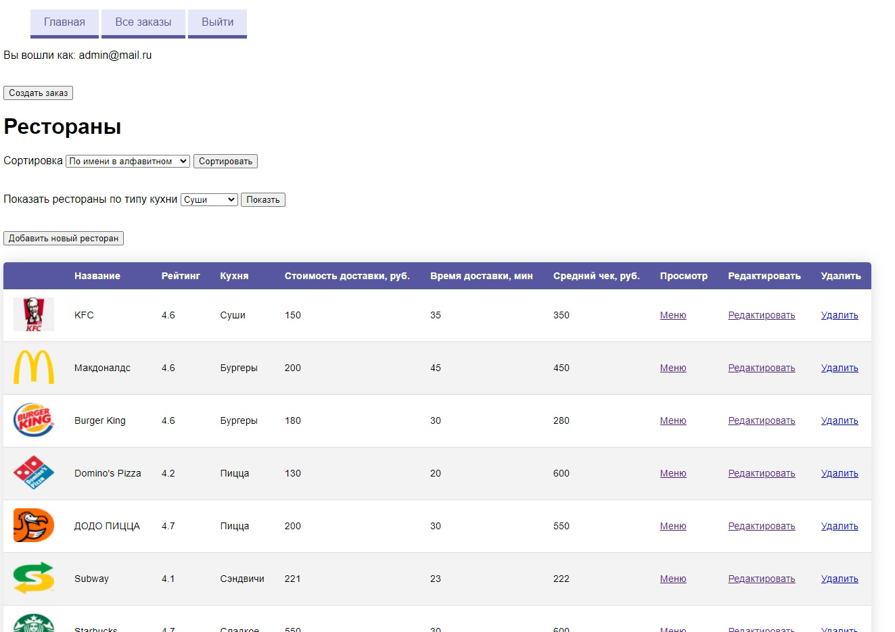
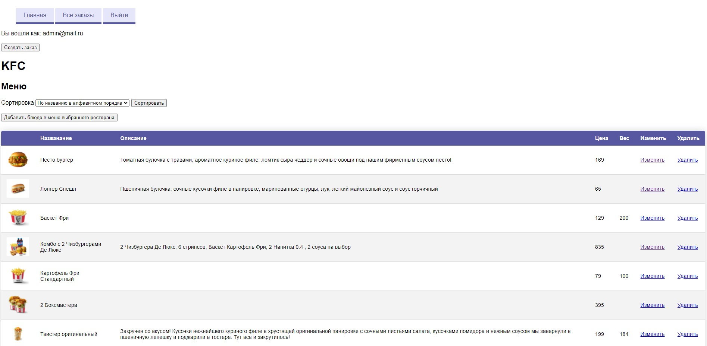
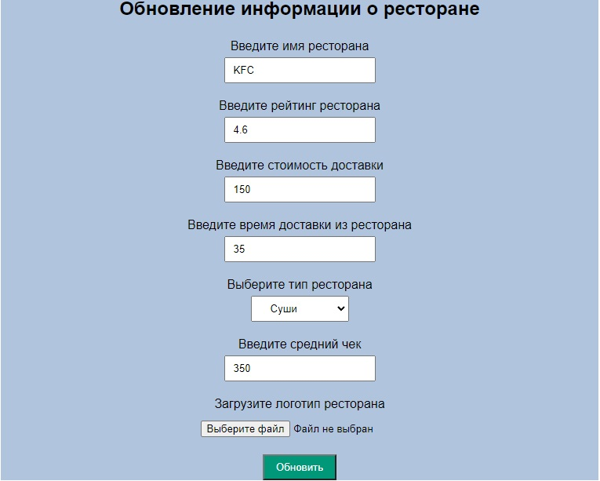
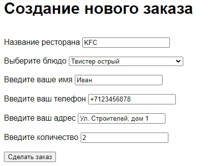

# Delivery-food
### Pet project
СRUD приложение реализующее сервис для заказа и доставки еды.

### Используемые технологии
Spring Boot, Spring MVC, Spring Data, Spring Security, Spring Validation, 
PostgreSQL, Maven, JUnit, Mockito, MapStruct, Slf4j, Thymeleaf.

__________________________________________________

__________________________________________________

__________________________________________________

## Обзор приложения

### Авторизация
| Логин | Пароль | Роль |  
| ------ | --- | ---------- 
| admin@mail.ru   | admin | ADMIN
| user@mail.ru   | user| USER 

### Рестораны
| Метод | URL | Описание |  
| ------ | --- | ---------- 
|  GET  | /index | Получение всех ресторанов
| GET  | /restaurant/new| Получение формы создания ресторана 
| GET  | /restaurant/{id}/update| Получение формы обновления ресторана по id
| POST  | /restaurant/save-or-update| Создание или обновление информации о ресторане 
| GET  | /restaurant/{id}/delete| Удаление ресторана по id 
| GET  | /restaurants-by-cuisine| Получение списка ресторана по типу 

### Блюда
| Метод | URL | Описание |  
| ------ | --- | ---------- 
|  GET  | /restaurant/{restaurantId}/dish | Получение меню ресторана по его id
| POST  | /restaurant/dish/new| Получение формы создания блюда 
| GET  | /dish/{id}/update| Получение формы обновления блюда по id
| POST  | /restaurant/dish/save-or-update| Создание или обновление информации о блюде 
| GET  | /dish/{id}/delete| Удаление блюда по id 

### Заказы
| Метод | URL | Описание |  
| ------ | --- | ---------- 
|  GET  | /order | Получение всех заказов
| POST  | /order/new| Получение формы создания заказа 
| POST  | /order/{id}/update| Получение формы обновления заказа 
| POST  | /order/save-or-update-order-step1| Создание или обновление информации о заказе шаг 1
| POST  | /order/save-or-update-order-step1| Создание или обновление информации о заказе шаг 2
| GET  | /order/{id}/delete| Удаление заказа по id 
